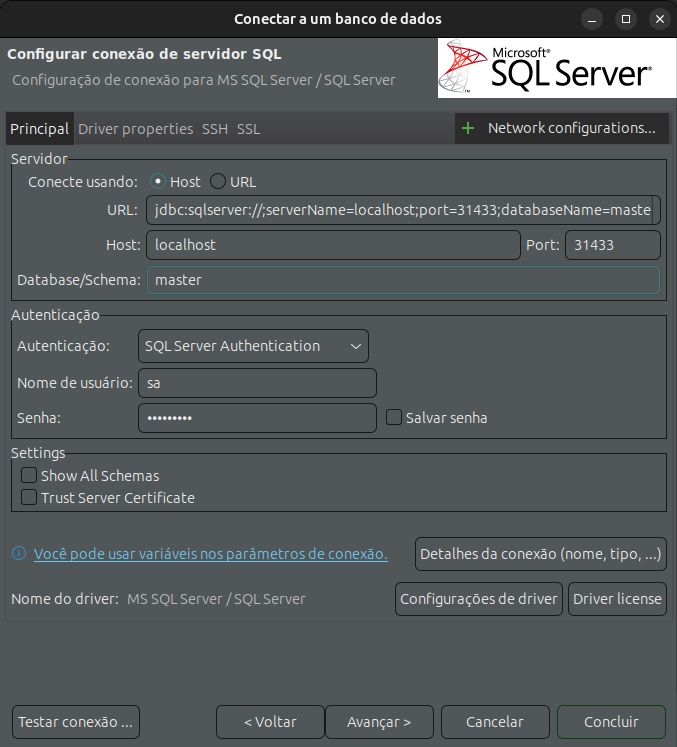
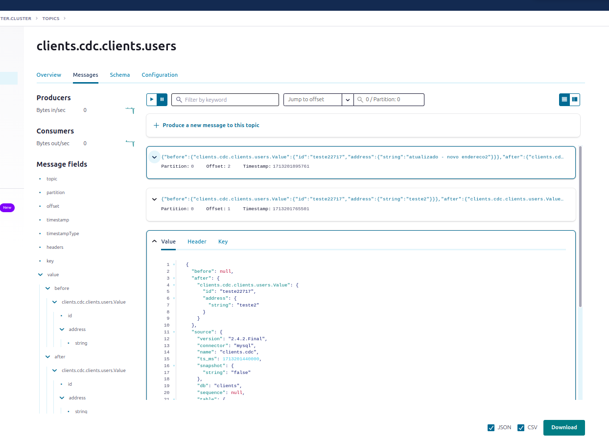
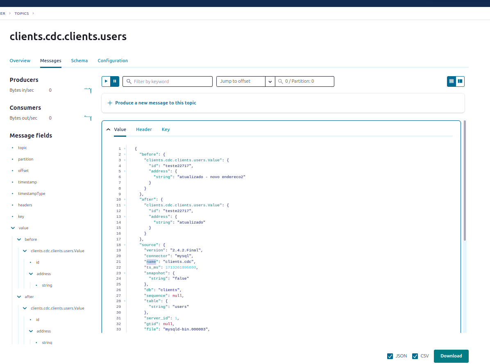
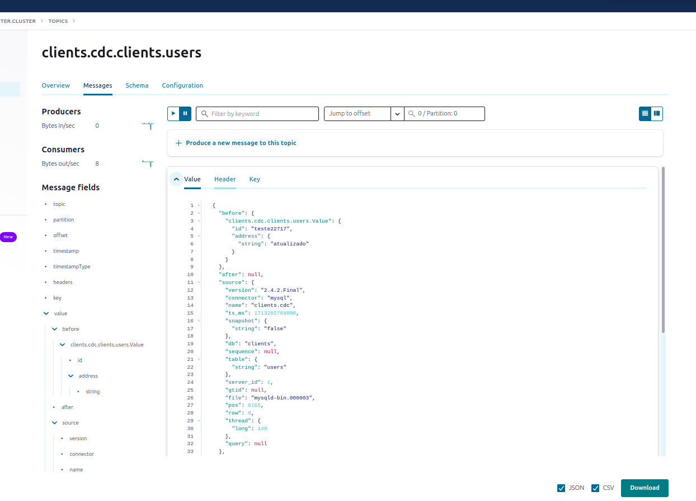

# kafka--estudo-microsoft-cdc-source-connector
Projeto para estudo de aplicação para estudo do uso do design pattern Change Data Capture (CDC) para monitorar alterações em um banco de dados com o Kafka


## Sumário
- [Tecnologias](#tecnologias)
- [Arquitetura de Software para Desenvolvimento](#arquitetura-de-software-para-desenvolvimento)
- [Arquitetura dos componentes](#arquitetura-dos-componentes)
    - [service--userdata](#service--userdata)
    - [service--push-email](#service--push-email)
- [Criação banco de dados](#criação-banco-de-dados)
    - [Kubernetes](#kubernetes)
        - [Acessar o banco de dados](#acessar-o-banco-de-dados)
- [Referencias](#referencias)

## Tecnologias

- MySQL
- Apache Kafka 3.5
- Kafka Connectors
- Kubernetes
- **(A definir linguagem de programação dos serviços)**


## Arquitetura de Software para Desenvolvimento

Todos os projetos desenvolvidos no estudo irão seguir o design arquitetural da Arquitetura Hexagonal, afim de pratica a separação dos componentes internos e externos da camada de negócio. Os projetos terão a estrutura do desenho a seguir:


Estrutura do projeto:

- **Transport Layer**: Camada para a entrada de dados do projeto, podendo ser um controller REST API, uma FILA SQL, etc.

- **Interactors**: Camada de negócio da aplicação, que representa toda a logica do negócio, como validações, utilizando principalmente a camada de entities como seus objetos.

- **Entities**: Camada de dominio dos objetos, eles representam a camada de dominio e contem os objetos que representam os conceitos principais para o negócio.

- **Repositories**: Camada de acesso a recursos externos da aplicação, nessa camada ainda não é definida a tecnologia dos recursos externos, sendo apenas uma porta de acesso para serviços fora da aplicação.

- **Data Sources**: Camada que representa os recursos externos que são acessiveis pela camada de Repositories da aplicação, podendo ser um banco de dados, um serviço externo que responde por REST API, uma fila, etc.


## Arquitetura dos componentes

A seguir está detalhado os componentes que irão compor o estudo


### service--userdata
Serviço é responsavel por todas as alterações de dados de usuário realizadas no banco de dados. O serviço irá responder via REST API.

### userdata
Banco de dados que terá armazenados os dados do usuário. O banco será configurado para utilizar o Desing Pattern CDC, assim todas as alterações realizadas no banco serão armazenadas em uma tabela SQL separa.

### Kafka Source Connector
Conector Kafka Microsoft SQL Server CDC Source Connector para integrar com o banco de dados, sendo responsavel por produzir as mensagens de atualização de dados cadastrais para um tópico Kafka.

### cdc.info-user
Tópico Kafka responsavel por receber as atualizações de dados cadastrais, essa informação será consumida pelo serviço de push por email. O objetivo do tópico é informar a todas as partes interessadas sobre a atualização de dados cadastrais.


### service--push-email
Serviço responsavel por realizar o envio de notificações para usuários via email. O serviço irá consumir o tópico kafka cdc.inf-user para que seja enviado sobre a atualização de dados cadastrais para o usuário


## Criação banco de dados


### Kubernetes

Para criar o banco de dados, será utilizado o Kubernetes para a infraestrutura do servidor. Para o teste local, está sendo utilizado o [Microk8s](https://microk8s.io/).

 Com o arquivo .kubeconfig configurado no seu computador, para criar o banco de dados no cluster Kubernetes, basta acessar o diretório ```k8s/microsoft-sql-server/``` e executar o comando a seguir:

```sh
kubectl apply -k .

namespace/mssql created
service/mssql created
pod/mssql created
```

para validar a execução do pod do banco de dados, basta listar o pod pelo namespace com o comando a seguir:

```sh
kubectl get pods -n mssql

NAME    READY   STATUS    RESTARTS   AGE
mssql   1/1     Running   0          8m41s
```

#### Acessar o banco de dados

Para acessar o banco de dados, está sendo utilizado o [DBeaver](https://dbeaver.io/). Para conectar com o banco executado localmente no Microk8s, basta acessar com a host `localhost`, porta `31433` (porta exposta pelo service), usuario `sa` e a senha está no artefato kubernetes `pod.yaml`.




## Criação do conector CDC

Para criar o conector CDC, será utilizado o Mysql Debezium CDC Source Connector, que será o responsavel por consumir a tabela de alteração do Bin log do Mysql e criar eventos em um tópico Kafka. Para, será realizado a criação do conector via rest API Proxy do Confluent Platform. conforme o exemplo abaixo:

```sh
curl --location 'http://localhost:8083/connectors' \
--header 'Content-Type: application/json' \
--data '{
  "name": "mysql-debezium-cdc-source-user-teste", #nome connector
  "config": {
    "database.history.kafka.bootstrap.servers": "broker.kafka.svc.cluster.local:29092", #url cluster kafka
    "database.server.name": "teste", #nome do database
    "schema.history.internal.kafka.bootstrap.servers": "broker.kafka.svc.cluster.local:29092", #url cluster kafka
    "schema.history.internal.kafka.topic": "schemahistory.changes", #nome tópico para alteração das tabelas monitoradas
    "debezium.source.database.history": "io.debezium.relational.history.FileDatabaseHistory", #forma de armazenamento das alterações
    "connector.class": "io.debezium.connector.mysql.MySqlConnector", #classe do connector
    "tasks.max": "1", #numero de tasks do conector em execução
    "topic.prefix": "clients.cdc", #prefixo do tópico de eventos
    "database.hostname": "mysql.mysql.svc.cluster.local",
    "database.port": "3306", # porta do banco de dados
    "database.user": "root", #usuario do banco de dados
    "database.password": "*********", #senha do usuário do banco de dados
    "database.server.id": "1", # id do servidor de banco de dados
    "column.include.list": ".*id, .*address" #campos que deseja monitorar,
    "table.include.list": ".*users" #tabela que deseja monitorar,
    "include.schema.changes": "false", # flag para habilitar se deseja monitorar alterações nas tabelas do database
    "table.ignore.builtin": "true", #flag para ignorar database do sistema
    "database.include.list": ".*clients, clients" #database que deseja monitorar
  }
}'
```

Executado a requisição, o conector irá passar a publicar eventos de criação, alteração e deleção na tabela informada, e nestes eventos terão os campos informados na criação do connector. A seguir os exemplos das operações:


*Exemplo de evento de criação de usuário*


*Exemplo de evento de atualização de dados de usuário*


*Exemplo de evento de exclusão de usuário*

 

## Referencias

- [Hexagonal Architeture by netflixtechblog](https://netflixtechblog.com/ready-for-changes-with-hexagonal-architecture-b315ec967749)
- [C4 Model](https://c4model.com/)

- [SQL Server on Linux on Kubernetes: Part 1](https://www.phillipsj.net/posts/sql-server-on-linux-on-kubernetes-part-1/)

- [Debezium Mysql Connector](https://debezium.io/documentation/reference/stable/connectors/mysql.html)